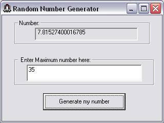



## Random Number Generator\_

### Description

Randomly Generates Numbers.
 
### More Info
 
It asks the maximum number you want generated through a text box.

It returns the generated number in a label.

             |
---                |---
**Submitted On**   |2003-02-02 16:44:40
**By**             |[Gerald Sornsen](https://github.com/Planet-Source-Code/PSCIndex/blob/master/ByAuthor/gerald-sornsen.md)
**Level**          |Beginner
**User Rating**    |3.0 (6 globes from 2 users)
**Compatibility**  |VB 6\.0
**Category**       |[Miscellaneous](https://github.com/Planet-Source-Code/PSCIndex/blob/master/ByCategory/miscellaneous__1-1.md)
**World**          |[Visual Basic](https://github.com/Planet-Source-Code/PSCIndex/blob/master/ByWorld/visual-basic.md)
**Archive File**   |[Random\_Num153884232003\.zip](https://github.com/Planet-Source-Code/gerald-sornsen-random-number-generator__1-42926/archive/master.zip)

